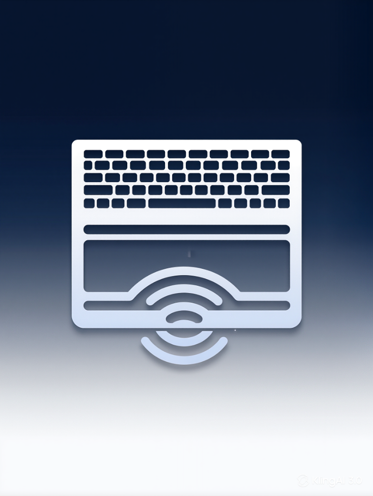

# 📱 Phone Keyboard & Trackpad

Turn your smartphone into a wireless keyboard and trackpad for your Windows PC. Designed for seamless swipe-typing, low-latency control, and easy installation.



## ✨ Features
- **Swipe Typing**: Use your phone's native keyboard (Gboard, iOS Keyboard, etc.) for high-speed typing.
- **Trackpad Mode**: Precision mouse control with tap-to-click, two-finger right click, and two-finger scroll.
- **PWA Support**: Install it on your phone's home screen for instant access.
- **Zero Configuration**: QR code scanning for automatic connection ⚡ (No IP addresses to type).
- **Modifier Keys**: Dedicated buttons for Ctrl, Alt, Shift, and Win.
- **Quick Shortcuts**: One-tap buttons for Copy, Paste, Undo, Save, and more.

---

## 🚀 How to Run

### 1. Prerequisites
- **Node.js**: [Download and install Node.js](https://nodejs.org/) (LTS recommended).
- **Windows PC**: This project uses a PowerShell helper to inject keystrokes into Windows.

### 2. Setup
Clone the repository (or download the files) and install dependencies:
```powershell
# Navigate to the project folder
cd phone-keyboard

# Install dependencies
npm install
```

### 3. Start the Server
Run the start command. This will launch the Node.js server and the PowerShell bridge.
```powershell
npm start
```

### 4. Connect Your Phone
1. Ensure your **phone and PC are on the same Wi-Fi network**.
2. Look at your PC terminal — it will show a **Local URL** and a **QR Code**.
3. **Scan the QR Code** with your phone's camera.
4. Tap the link to open the interface in your mobile browser.

---

## 📲 Install as an App (PWA)
To make **Phone Keyboard** live on your home screen:
- **iPhone (Safari)**: Tap the **Share** button (square with arrow) → Scroll down → **Add to Home Screen**.
- **Android (Chrome)**: Tap the **three dots** (⋮) → **Install App** or **Add to Home screen**.

---

## 🛠️ Troubleshooting

### "Connection Refused" or "Cannot Reach Page"
- **Firewall**: Your Windows Firewall might block the port. You may need to allow `Node.js` through the Private network firewall.
- **Wi-Fi**: Ensure both devices aren't on a Guest network or using a VPN, as these often block local peer-to-peer connections.
- **IP Address**: If the QR code doesn't work, try the IP address listed in the terminal manually.

### Keystrokes Not Working
- Ensure you see **"✅ Keystroke helper ready"** in the terminal.
- Ensure the application you want to type into is the **active window** on your PC.

---

## 📜 License
MIT
